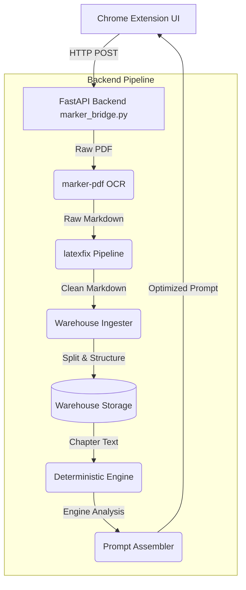

# PDF Reader, Organizer & Study Engine

A comprehensive system that extracts text from PDFs (books, papers, slides) using AI-powered OCR, corrects broken $\LaTeX$ mathematics, organizes the documents into a structured library by chapters, and runs deterministic analysis to generate optimized study prompts for Large Language Models (LLMs).

All processing happens **100% locally** on your machine.


---

## 🎯 The Core Idea

The core philosophy of this project is to create the **perfect pipeline from a raw PDF into an LLM's context window**. 

Standard PDF parsers often destroy formatting, scramble matrices (especially from Beamer slides), and lose document structure. This system solves that by:
1. **Precision Extraction:** Using `marker-pdf` for state-of-the-art layout detection and OCR.
2. **Mathematical Reconstruction (`latexfix`):** Automatically detecting mangled matrices and broken math expressions, reconstructing them, and even intelligently computing solutions (e.g., normal equations $X'X \rightarrow \hat{\beta}$) before putting them in the Markdown.
3. **Semantic Chunking (`warehouse`):** Intelligently splitting massive books into logical chapters based on Table of Contents, headings, and page patterns. 
4. **Deterministic Pre-computation (`engine`):** Extracting formulas, variables, concepts, and mapping dependencies using deterministic algorithms *before* sending anything to an LLM.
5. **Prompt Assembly:** Combining the reconstructed text and deterministic metadata into highly optimized prompts, reducing LLM hallucinations and improving reasoning.

---

## 🏗️ System Architecture

The project is split into two main halves: a **Chrome Extension (Frontend)** for the UI, and a **FastAPI Python Server (Backend)** for heavy lifting.



---

## 🧩 Detailed Component Breakdown

### 1. The Backend Bridge (`marker_bridge.py`)
This is the central nervous system of the project. It is a FastAPI server (`localhost:8001`) that exposes endpoints for the Chrome Extension to interact with.
- **Conversion (`/convert`):** Accepts a PDF file, runs it through `marker-pdf`, applies `latexfix`, and returns the Markdown.
- **Warehouse Management (`/warehouse/*`):** Endpoints to upload PDFs, list books, view chapters, and scan the local file system.
- **Engine Analysis (`/engine/*`):** Endpoints to trigger the deterministic engine on specific chapters and build LLM prompts.

### 2. Mathematics Reconstruction (`latexfix/`)
When extracting text from academic slides (like Beamer), matrices and mathematical symbols are often broken or misaligned. The `latexfix` module is a custom end-to-end pipeline to solve this.
- **`detector.py`:** Uses regular expressions to find isolated numbers, brackets, and broken tabular data that looks like a mangled matrix.
- **`pipeline.py`:** The orchestrator. It cleans up broken decimal numbers and extracts the matrices.
- **`matrix_extractor.py`:** Not only formats the matrix back into valid `\begin{bmatrix}` $\LaTeX$ syntax, but can also computationally resolve equations. For example, if it detects $X'X$ and $X'y$, the `auto_solve` function actually computes the matrix inverse and solves the normal equation for $\hat{\beta}$ natively via NumPy, inserting the mathematically correct $\LaTeX$ back into your notes.

### 3. The Library System (`warehouse/`)
The warehouse is responsible for ingesting, structuring, and storing the documents.
- **`ingester.py`:** The core ingestion pipeline. When a PDF is uploaded, the ingester:
  1. Saves the raw file securely.
  2. Extracts the text using `marker-pdf`.
  3. Patches the math using `latexfix`.
  4. Runs complex heuristic regex algorithms to detect chapter boundaries (looking for "Chapter N", Roman numerals, consistent headers, or Table of Contents).
  5. Triggers the `FormulaExtractor` on each chapter.
- **`models.py`:** Defines the data structure (`Book` and `Chapter`) ensuring consistent metadata schemas.
- **`storage.py`:** Handles the local persistence of the books and their extracted data in the `warehouse/data/` directory.

### 4. Deterministic Analysis (`engine/`)
Instead of making an LLM read the whole chapter and guess the formulas, the `engine` pre-extracts and analyzes the text deterministically.
- **`formula_extractor.py`:** Finds all `$$...$$` and `$...$` notations. Crucially, it traverses the surrounding text to find variable definitions (e.g., catching "where $m$ is mass and $c$ is the speed of light") and attaches this context to the formula metadata.
- **`concept_extractor.py` / `density_analyzer.py` / `structure_analyzer.py` / `dependency_mapper.py`:** Tools that statically analyze the text to find key terms, measure information density, map out document structure, and track conceptual dependencies.
- **`prompt_assembler.py`:** The final step. It combines the raw chapter text, the extracted formulas, and the concept maps into a densely packed, highly structured prompt. It supports different modes (e.g., `deep_dive`) so you can instantly paste the result into ChatGPT/Claude.

### 5. Frontend UI (Chrome Extension)
The user interface lives directly in your browser as a Chrome Extension.
- **`popup.html` & `popup.js`:** A lightweight popup for fast conversions. You can open a PDF in your browser, click the extension icon, and instantly convert the active page or the whole document to Markdown.
- **`organizer.html` & `organizer.js`:** A full-page dashboard acting as your study library. Here you can view your Warehouse, browse books by metadata, select specific chapters, read the cleaned Markdown, and click exactly one button to generate a master study prompt for your LLM.
- **`math-utils.js` / `markdown.js` / `parser.js`:** Client-side utilities to ensure the text and math render beautifully within the extension's UI before you copy it.
- **`content.js` / `marker-client.js`:** The glue that grabs the PDF binary from the Chrome tab and proxies it securely to your local FastAPI backend.

---

## 🚀 Setup & Installation

### Prerequisites
- **Python 3.9+**
- **Google Chrome** (or Chromium-based browser)

### 1. Install Backend Dependencies
Navigate to the root directory and install the required packages:
```bash
pip install marker-pdf fastapi uvicorn python-multipart numpy
```

### 2. Start the Backend Server
Run the FastAPI bridge. This must be running for the extension to work.
```bash
python marker_bridge.py
```
*You should see it start on `http://localhost:8001`.*

### 3. Load the Chrome Extension
1. Open Chrome and navigate to `chrome://extensions/`
2. Enable **Developer mode** (toggle in top-right corner).
3. Click **"Load unpacked"**.
4. Select this project folder (specifically, the folder containing `manifest.json`).
5. The **PDF to Markdown** icon will appear in your toolbar.

---

## 📖 How to Use

**Quick PDF Conversion:**
1. Open any PDF in Chrome.
2. Click the extension icon in your toolbar.
3. Configure your pages (or leave blank for the whole document).
4. Click **Convert** to get instant Markdown copied to your clipboard.

**Using the Study Organizer:**
1. Open the Organizer from the extension.
2. Upload a book PDF. The backend will automatically OCR it, fix the math, and split it by chapters.
3. Select a Chapter.
4. Click **Summarize / Deep Dive** to trigger the deterministic engine.
5. Paste the generated prompt into ChatGPT or Claude for a flawless study session!
