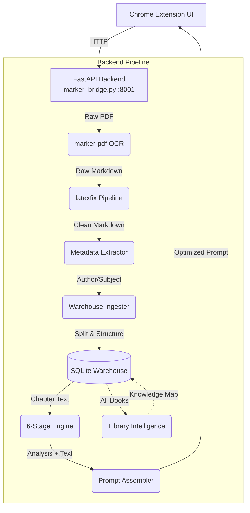
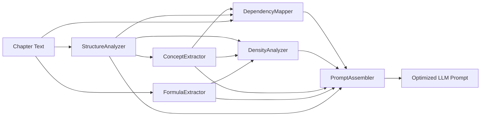

# PDF Reader, Organizer & Study Engine

A comprehensive system that extracts text from PDFs (books, papers, slides) using AI-powered OCR, reconstructs broken $\LaTeX$ mathematics, organizes documents into a structured library by chapters, and runs a fully **deterministic analysis engine** to generate optimized study prompts for Large Language Models.

All processing happens **100% locally** on your machine. No API calls. No cloud dependencies. No recurring costs.


---

## Table of Contents

- [Why This Exists](#-why-this-exists)
- [Key Features](#-key-features)
- [System Architecture](#-system-architecture)
- [Component Breakdown](#-detailed-component-breakdown)
  - [Backend Bridge](#1-the-backend-bridge-marker_bridgepy)
  - [LaTeX Reconstruction](#2-mathematics-reconstruction-latexfix)
  - [Library System](#3-the-library-system-warehouse)
  - [Deterministic Engine](#4-deterministic-analysis-engine-engine)
  - [Library Intelligence](#5-library-intelligence-enginelibrary_intelligencepy)
  - [Frontend UI](#6-frontend-ui-chrome-extension)
- [Why Not Just Send the PDF to ChatGPT?](#-why-not-just-send-the-pdf-to-chatgpt)
- [Study Modes](#-study-modes)
- [API Reference](#-api-reference)
- [Setup & Installation](#-setup--installation)
- [How to Use](#-how-to-use)
- [Project Structure](#-project-structure)
- [Performance](#-performance)
- [Testing](#-testing)

---

## 🎯 Why This Exists

If you've ever tried to study from a textbook PDF using an LLM, you've hit these walls:

| Problem | What happens |
|---|---|
| **Broken math** | OCR scrambles matrices, turns `β̂` into garbage, splits equations across lines |
| **Lost structure** | The LLM gets a wall of text with no chapter boundaries |
| **Hallucination** | The model invents definitions instead of quoting the author's |
| **Token waste** | Sending a 500-page book costs a fortune in tokens — *every single time you ask a question* |
| **No memory** | The LLM can't cross-reference your other textbooks. It forgets page 50 by page 200 |

This project solves all of them by building a **deterministic intelligence layer** between your PDFs and the LLM:

1. **Precision Extraction** — Uses `marker-pdf` for state-of-the-art layout detection and OCR.
2. **Mathematical Reconstruction** — The `latexfix` pipeline detects mangled matrices and broken math, reconstructs valid $\LaTeX$, and can even **compute solutions** (e.g., solving the normal equation $\hat{\beta} = (X'X)^{-1}X'y$ via NumPy).
3. **Semantic Chunking** — Intelligently splits books into logical chapters using Table of Contents, heading patterns, and page-break analysis.
4. **Deterministic Pre-computation** — Extracts every formula, variable definition, concept, and dependency graph **before** the LLM touches anything.
5. **Prompt Assembly** — Combines reconstructed text and deterministic metadata into highly structured prompts that eliminate hallucination and reduce token costs by orders of magnitude.

---

## ✨ Key Features

### 📖 Intelligent PDF Ingestion
- AI-powered OCR via `marker-pdf` with GPU acceleration
- Memory-optimized chunked extraction for 500+ page books
- Automatic metadata extraction (author, subject) from PDF properties
- Singleton model loading — first book takes ~15s, subsequent books are instant

### 🔢 LaTeX Mathematics Reconstruction
- Detects mangled matrices, broken decimal numbers, and scrambled math from Beamer slides
- Reconstructs valid `\begin{bmatrix}` syntax automatically
- **Computational math:** can actually solve matrix equations (normal equations, matrix inverses) and insert the correct $\LaTeX$ result
- Shape inference: auto-detects column vectors vs. square matrices from variable names

### 📚 Library Management
- SQLite-backed storage with WAL mode for concurrent access
- Automatic chapter detection (3 strategies: explicit chapters → top-level headings → page breaks)
- Study status tracking per chapter (`not_started` → `in_progress` → `completed`)
- Search across your entire book collection
- Background ingestion with real-time SSE progress streaming

### 🧠 Deterministic Analysis Engine (6-stage pipeline)
- **StructureAnalyzer** — Builds a hierarchical heading tree with word counts
- **ConceptExtractor** — Identifies key terms, acronyms, bold/italic definitions with importance ranking
- **FormulaExtractor** — Isolates every `$...$` and `$$...$$` block, captures surrounding variable definitions
- **DependencyMapper** — Finds relationship markers ("depends on", "in contrast to", "generalizes") and builds a concept graph
- **DensityAnalyzer** — Classifies each section as "math-heavy", "example-heavy", "code-heavy", etc.
- **LibraryIntelligence** — Cross-references new books against your existing library using TF-IDF cosine similarity

### 🎓 4 Study Modes
- **Deep Dive** — Comprehensive breakdown of every concept and formula
- **Exam Prep** — Flashcards, practice problems, common traps
- **Quick Review** — Condensed cheat-sheet summary
- **Socratic Dialogue** — Interactive teacher-student conversation format

### 🖥️ Chrome Extension UI
- One-click PDF → Markdown conversion from any browser tab
- Full library dashboard with book browsing and chapter selection
- Beautiful in-browser math rendering via KaTeX
- Copy-to-clipboard prompt generation

---

## 🏗️ System Architecture

The project is split into two halves: a **Chrome Extension** for the UI, and a **FastAPI Python Server** for the heavy lifting.



### Data Flow

```
PDF File
  │
  ├─ marker-pdf ──► Raw Markdown (with broken math)
  │
  ├─ latexfix ────► Clean Markdown (valid LaTeX, solved matrices)
  │
  ├─ Ingester ────► Chapter Detection (3 strategies)
  │                  ├─ Explicit "Chapter N" headings
  │                  ├─ Top-level # headings
  │                  └─ Page-break fallback
  │
  ├─ Per-Chapter (parallel) ──► FormulaExtractor → extract $formulas$
  │                             ConceptExtractor → extract key terms
  │                             StructureAnalyzer → build heading tree
  │
  ├─ Storage ─────► SQLite (books, chapters, markdown, prompts, analysis)
  │
  └─ Intelligence ► TF-IDF + SequenceMatcher cross-referencing
```

---

## 🧩 Detailed Component Breakdown

### 1. The Backend Bridge (`marker_bridge.py`)

The central nervous system. A FastAPI server on `localhost:8001` that exposes all endpoints for the Chrome Extension.

**Key capabilities:**
- **PDF Conversion** (`POST /convert`): Accepts a PDF, runs `marker-pdf` + `latexfix`, returns Markdown with per-page sections.
- **Background Ingestion** (`POST /warehouse/upload`): Non-blocking PDF processing with SSE progress streaming. The server stays responsive while processing 500-page books.
- **Library Scanning** (`POST /warehouse/scan`): Auto-discovers PDFs in the `raw_source/` folder and ingests any new ones.
- **Engine Analysis** (`POST /engine/analyze/{book}/{ch}`): Runs the 6-stage deterministic pipeline on a chapter.
- **Prompt Building** (`POST /engine/prompt/{book}/{ch}`): Full pipeline → structured prompt, with caching.
- **Sync endpoints** run in FastAPI's thread pool so the event loop is never blocked.

---

### 2. Mathematics Reconstruction (`latexfix/`)

When extracting text from academic slides (especially Beamer), matrices and math are often destroyed. The `latexfix` module is a custom end-to-end pipeline to fix this.

| Module | Purpose |
|---|---|
| `detector.py` | Regex-based detection of isolated numbers, broken brackets, and mangled tabular data |
| `pipeline.py` | Orchestrator: cleans broken decimals, detects matrices, manages the full fix pipeline |
| `matrix_extractor.py` | Converts detected numbers back into valid `\begin{bmatrix}` LaTeX. Can also **compute** matrix operations (inverse, normal equations) via NumPy |
| `renderer.py` | Handles shape inference (column vector vs. square matrix from name hints), document patching (replacing raw text with LaTeX), and Jupyter display helpers |

**Example:** If the pipeline detects matrices named `X'X` and `X'y`, the `auto_solve` function actually computes $(X'X)^{-1}X'y = \hat{\beta}$ using NumPy and inserts the mathematically correct $\LaTeX$ solution back into your notes.

---

### 3. The Library System (`warehouse/`)

The warehouse handles ingestion, structuring, and persistent storage of your document library.

| Module | Purpose |
|---|---|
| `ingester.py` | Full pipeline orchestrator. Singleton marker models, chunked extraction, parallel chapter analysis, background knowledge mapping |
| `models.py` | Data models: `Book`, `Chapter`, `Concept`, `Formula` — all with `to_dict()` / `from_dict()` serialization |
| `storage.py` | **SQLite-backed** persistence with WAL mode. Schema: `books`, `chapters`, `markdown`, `prompts`, `analysis`. Auto-migrates from legacy JSON format |

**Ingestion Pipeline (7 Steps):**
1. Copy PDF to `raw_source/` with hash-based naming
2. Create book record (status: `processing`)
3. Extract markdown via `marker-pdf` (chunked, memory-optimized, GPU cache cleanup)
4. Apply `latexfix` to reconstruct broken mathematics
5. Auto-extract metadata (author, subject) from PDF properties + content
6. Detect chapter boundaries using 3-tier heuristic strategy
7. Analyze each chapter in parallel (structure, concepts, formulas)
8. Build Library Intelligence knowledge map (background thread)

**Storage Performance:**
- Single SQLite file replaces 20+ JSON file reads per `get_chapters()` call
- WAL mode enables concurrent reads during background processing
- 8MB cache, foreign key cascading deletes, indexed lookups
- Automatic migration from legacy JSON-file format

---

### 4. Deterministic Analysis Engine (`engine/`)

Instead of making an LLM read the whole chapter and guess, the engine pre-extracts everything deterministically — **no AI needed for the analysis**.



| Stage | Module | What it does |
|---|---|---|
| 1 | `structure_analyzer.py` | Converts headings into a hierarchical tree with word counts per section |
| 2 | `concept_extractor.py` | Identifies key terms, acronyms, bold/italic definitions. Ranks by importance (`high`/`medium`/`low`) based on frequency and formatting |
| 3 | `formula_extractor.py` | Finds all `$...$` and `$$...$$` blocks. Traverses surrounding text to find variable definitions (e.g., "where $m$ is mass") and attaches context |
| 4 | `dependency_mapper.py` | Scans for relationship keywords ("depends on", "in contrast to", "generalizes", "is a special case of") and builds a directed concept graph with clusters |
| 5 | `density_analyzer.py` | Classifies each section: "math-heavy", "example-heavy", "code-heavy", "definition-heavy". Tells the LLM *how* to explain each section |
| 6 | `prompt_assembler.py` | Combines everything into a structured prompt with headers, concept lists, formula sheets, dependency graphs, and mode-specific instructions |

---

### 5. Library Intelligence (`engine/library_intelligence.py`)

When you add a new book, the Intelligence Engine compares it against every book already in your warehouse — **fully offline, fully deterministic**.

**Three similarity dimensions:**
| Dimension | Algorithm | What it measures |
|---|---|---|
| Name Similarity | `SequenceMatcher` | How similar the book titles are (character-level) |
| Structure Similarity | `SequenceMatcher` | How similar the ordered chapter title sequences are |
| Concept Overlap | TF-IDF Cosine Similarity | How many extracted concepts are shared (weighted by rarity) |

**Weighted scoring:** `total = 0.2 × name + 0.3 × structure + 0.5 × concept`

The concept score is weighted highest because two books can have completely different titles and chapter orders but cover the same material. The engine builds IDF across your entire library corpus, so rare shared concepts score much higher than common ones.

**Result:** When generating a study prompt, the `PromptAssembler` automatically includes cross-references to related books in your library — e.g., *"For more on this concept, see Chapter 9 of Linear Algebra Done Right (Score: 0.73)"*.

---

### 6. Frontend UI (Chrome Extension)

The user interface lives in your browser as a Chrome Extension (Manifest V3).

| File | Purpose |
|---|---|
| `popup.html` / `popup.js` | Lightweight popup for quick PDF → Markdown conversion from any browser tab |
| `organizer.html` / `organizer.js` / `organizer.css` | Full-page study dashboard: book library, chapter browser, markdown viewer, prompt generator |
| `math-utils.js` | KaTeX-based math rendering for beautiful in-browser equation display |
| `markdown.js` | Client-side markdown-to-HTML conversion with LaTeX support |
| `parser.js` | Parsing utilities for splitting and processing extracted text |
| `content.js` / `marker-client.js` | Grabs PDF binary from the active Chrome tab and proxies it to the local FastAPI backend |
| `styles.css` | Core extension styling |

---

## 🤔 Why Not Just Send the PDF to ChatGPT?

Most people's instinct is to drag the PDF into ChatGPT and ask questions. **This approach has fundamental flaws:**

### 1. Cost & Token Efficiency 💸
| | Direct PDF approach | This system |
|---|---|---|
| **Per question** | Re-send the whole book every time (~500K tokens) | Send only the pre-built prompt (~5K tokens) |
| **Processing cost** | Paid API call every single time | One-time free local processing |
| **Speed** | Minutes per query on large books | Instant (prompts are cached in SQLite) |

### 2. Zero Hallucination 🚫
| | Direct PDF approach | This system |
|---|---|---|
| **Definitions** | LLM might paraphrase or invent definitions | Engine extracts the *exact* definition from the text |
| **Formulas** | LLM might "recall" a wrong formula from training | Engine extracts the *exact* LaTeX from the book |
| **Variables** | LLM might guess what symbols mean | Engine finds "where $X$ is the design matrix" and attaches it to the formula |

### 3. Long-Term Memory & Cross-Referencing 📚
| | Direct PDF approach | This system |
|---|---|---|
| **Context limit** | Can't process 50 books simultaneously | Entire library is indexed and cross-referenced |
| **Lost in the middle** | Forgets content in the middle of long documents | Chapter-level chunking ensures nothing is lost |
| **Cross-referencing** | Cannot compare books | TF-IDF engine detects concept overlap across your entire library |

### 4. Reproducibility ♻️
The engine is **100% deterministic**. Given the same PDF, it produces the exact same analysis every time. No randomness, no temperature settings, no model drift.

---

## 🎓 Study Modes

| Mode | Best for | What the LLM produces |
|---|---|---|
| **Deep Dive** | First pass through dense material | Chapter overview → every concept explained with analogies → formula walkthroughs with worked examples → concept connections → practical applications → key takeaways |
| **Exam Prep** | Test preparation | Flashcard-format definitions → formula reference sheet → 10-15 conceptual questions with answers → 5-8 application problems → compare & contrast → common exam traps |
| **Quick Review** | Revision before class | 3-sentence TL;DR → bullet-point concept list → formula cheat sheet → concept map → one-paragraph summary |
| **Socratic** | Deep understanding | Teacher-student dialogue that follows concept dependencies, works through formulas step-by-step, and builds to synthesis questions |

---

## 📡 API Reference

All endpoints are served by the FastAPI backend at `http://localhost:8001`. Interactive docs at `/docs`.

### Core Conversion
| Method | Endpoint | Description |
|---|---|---|
| `POST` | `/convert` | Convert a PDF to Markdown (with latexfix) |
| `POST` | `/latexfix` | Apply latexfix to raw markdown text |

### Warehouse (Library Management)
| Method | Endpoint | Description |
|---|---|---|
| `POST` | `/warehouse/upload` | Upload & ingest a PDF (background by default) |
| `GET` | `/warehouse/progress/{job_id}` | SSE stream for real-time ingestion progress |
| `GET` | `/warehouse/job/{job_id}` | Polling fallback for job status |
| `GET` | `/warehouse/books` | List all books |
| `GET` | `/warehouse/books/{id}` | Get book metadata |
| `GET` | `/warehouse/books/{id}/chapters` | List chapters (metadata only) |
| `GET` | `/warehouse/books/{id}/chapters/{ch}` | Get chapter with full text |
| `GET` | `/warehouse/books/{id}/knowledge-map` | Get Library Intelligence matches |
| `DELETE` | `/warehouse/books/{id}` | Delete a book (cascading) |
| `GET` | `/warehouse/search?q=...` | Search books by title |
| `POST` | `/warehouse/scan` | Scan `raw_source/` for new PDFs |
| `PATCH` | `/warehouse/books/{id}/chapters/{ch}/status` | Update study status |
| `POST` | `/warehouse/rebuild-knowledge/{id}` | Rebuild knowledge map for a book |
| `POST` | `/warehouse/clear-errors` | Remove all errored books |
| `POST` | `/warehouse/clear-all` | Delete entire library |

### Engine (Analysis & Prompts)
| Method | Endpoint | Description |
|---|---|---|
| `GET` | `/engine/modes` | List available study modes |
| `POST` | `/engine/analyze/{book}/{ch}` | Run 6-stage deterministic analysis |
| `POST` | `/engine/prompt/{book}/{ch}` | Build optimized study prompt (with caching) |

---

## 🚀 Setup & Installation

### Prerequisites
- **Python 3.9+**
- **Google Chrome** (or any Chromium-based browser)
- **GPU recommended** for faster OCR (works on CPU too, just slower)

### 1. Install Backend Dependencies

```bash
pip install marker-pdf fastapi uvicorn python-multipart numpy pypdf psutil
```

### 2. Start the Backend Server

```bash
python marker_bridge.py
```

You'll see:
```
Starting Marker Bridge on http://localhost:8001
Docs available at http://localhost:8001/docs

Warehouse endpoints:
  POST   /warehouse/upload                — Upload a PDF book
  GET    /warehouse/books                  — List all books
  ...

Engine endpoints:
  GET    /engine/modes                     — List study modes
  POST   /engine/analyze/{book}/{ch}       — Analyze a chapter
  POST   /engine/prompt/{book}/{ch}        — Build study prompt
```

### 3. Load the Chrome Extension

1. Open Chrome and navigate to `chrome://extensions/`
2. Enable **Developer mode** (toggle in top-right corner)
3. Click **"Load unpacked"**
4. Select this project folder (the one containing `manifest.json`)
5. The **PDF to Markdown** icon will appear in your toolbar

---

## 📖 How to Use

### Quick PDF Conversion
1. Open any PDF in Chrome
2. Click the extension icon in your toolbar
3. Configure page range (or leave blank for the whole document)
4. Click **Convert** → Markdown is copied to your clipboard

### Using the Study Organizer
1. Open the Organizer dashboard from the extension
2. Upload a book PDF — the backend automatically:
   - Extracts text with OCR
   - Reconstructs broken math
   - Detects and splits chapters
   - Extracts formulas, concepts, and dependencies
   - Cross-references against your existing library
3. Select a chapter from the sidebar
4. Choose a study mode: **Deep Dive**, **Exam Prep**, **Quick Review**, or **Socratic**
5. Click **Generate Study Prompt**
6. **Copy** the prompt and paste it into ChatGPT, Claude, or Gemini

### Bulk Library Import
1. Place PDF files in the `raw_source/` folder
2. Click **Scan Library** in the Organizer (or `POST /warehouse/scan`)
3. All new PDFs are automatically ingested with progress tracking

### Track Your Study Progress
- Mark chapters as `not_started`, `in_progress`, or `completed`
- Status persists across sessions in the SQLite database

---

## 📁 Project Structure

```
pdf_reader/
├── marker_bridge.py          # FastAPI backend (all endpoints)
├── manifest.json             # Chrome Extension manifest (v3)
│
├── latexfix/                 # LaTeX reconstruction pipeline
│   ├── __init__.py           # LatexFix entry point
│   ├── detector.py           # Regex-based broken math detection
│   ├── pipeline.py           # Orchestrator (clean, detect, fix)
│   ├── matrix_extractor.py   # Matrix reconstruction + computation
│   └── renderer.py           # LaTeX rendering + document patching
│
├── warehouse/                # Library management system
│   ├── __init__.py           # Warehouse facade
│   ├── ingester.py           # Full PDF → chapters pipeline
│   ├── models.py             # Book, Chapter, Concept, Formula models
│   └── storage.py            # SQLite storage (WAL, cached, indexed)
│
├── engine/                   # Deterministic analysis engine
│   ├── __init__.py           # Engine orchestrator
│   ├── structure_analyzer.py # Heading tree builder
│   ├── concept_extractor.py  # Key term + definition extractor
│   ├── formula_extractor.py  # LaTeX formula extractor with context
│   ├── dependency_mapper.py  # Concept relationship graph builder
│   ├── density_analyzer.py   # Section type classifier
│   ├── metadata_extractor.py # PDF metadata extractor (author, subject)
│   ├── library_intelligence.py # TF-IDF cross-book matching
│   └── prompt_assembler.py   # Final prompt builder (4 study modes)
│
├── popup.html / popup.js     # Chrome extension popup (quick convert)
├── organizer.html/js/css     # Full study dashboard
├── math-utils.js             # KaTeX math rendering
├── markdown.js               # Markdown → HTML conversion
├── parser.js                 # Text parsing utilities
├── content.js                # Chrome tab PDF capture
├── marker-client.js          # Backend communication proxy
├── styles.css                # Extension core styles
│
├── raw_source/               # PDF storage directory
├── warehouse/data/           # SQLite database (warehouse.db)
│
├── tests/                    # Test suite
│   ├── test_engine.py        # Engine pipeline tests
│   ├── test_latexfix.py      # LaTeX reconstruction tests
│   ├── test_library_intelligence.py  # Cross-book matching tests
│   ├── test_performance.py   # Performance benchmarks
│   ├── test_phase1.py        # Integration tests (phase 1)
│   └── test_phase3.py        # Integration tests (phase 3)
│
├── icons/                    # Extension icons
├── lib/                      # Vendored JS libraries (KaTeX, etc.)
└── STUDY_PROCESS_REFERENCE.md # User-facing study guide
```

---

## ⚡ Performance

The system is optimized for processing large, multi-hundred-page textbooks:

| Optimization | Impact |
|---|---|
| **Singleton marker models** | Models loaded once (~15s), all subsequent books skip this cost |
| **Chunked PDF extraction** | Auto-calculates chunk size based on available RAM; GPU cache cleared between chunks |
| **Parallel chapter analysis** | `ThreadPoolExecutor(4)` analyzes structure, concepts, and formulas in parallel |
| **SQLite WAL mode** | Concurrent reads during background processing; 8MB cache |
| **Background knowledge mapping** | Library Intelligence runs in a daemon thread — ingestion returns instantly |
| **Prompt caching** | Generated prompts are cached per (book, chapter, mode) — subsequent calls are instant |
| **Analysis caching** | Engine analysis results are cached per (book, chapter) |
| **Batched storage writes** | `defer_index` mode accumulates writes, flush once at the end |
| **Memory cleanup** | Full markdown released from book object after storage; `gc.collect()` + `torch.cuda.empty_cache()` between chunks |

---

## 🧪 Testing

Run the full test suite:

```bash
python -m pytest tests/ -v
```

Individual test modules:
```bash
python -m pytest tests/test_engine.py -v          # Engine pipeline
python -m pytest tests/test_latexfix.py -v         # LaTeX reconstruction
python -m pytest tests/test_library_intelligence.py -v  # Cross-book matching
python -m pytest tests/test_performance.py -v      # Performance benchmarks
```

---

## 📜 License

MIT

---

*Built to eliminate the gap between raw PDFs and perfect LLM study sessions — because generating knowledge shouldn't cost you a fortune in API calls.*
